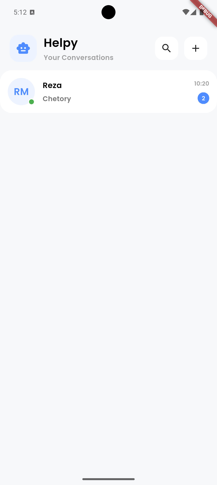

<div align="center">

# 💬 Flutter Chat App

A modern Chat Application built with **Flutter**, following **Clean Architecture** principles and powered by **BLoC**.

<p align="center">


</p>

> 🚧 This project is currently under active development.

---

</div>

# 📖 About Project

Flutter Chat App is a personal project created to practice modern Flutter development using **Clean Architecture** and **BLoC**.

The goal is to build a scalable, maintainable and production-ready chat application while following software engineering best practices.

This project is being developed step by step and new features will be added continuously.

---

# ✨ Features

- ✅ Clean Architecture
- ✅ BLoC State Management
- ✅ Repository Pattern
- ✅ Dependency Injection
- ✅ REST API Integration
- ✅ Login
- ✅ Register
- ✅ Users List
- 🚧 Real-Time Chat
- 🚧 SignalR Integration
- 🚧 User Profile
- 🚧 Online / Offline Status
- 🚧 Push Notifications
- 🚧 File Sharing
- 🚧 Dark Mode

---

# 🏛️ Architecture

```
lib
│
├── core
│   ├── network
│   ├── services
│   ├── errors
│   ├── utils
│   └── constants
│
├── features
│   │
│   ├── authentication
│   │   ├── data
│   │   ├── domain
│   │   └── presentation
│   │
│   ├── users
│   │   ├── data
│   │   ├── domain
│   │   └── presentation
│   │
│   └── chat
│
└── main.dart
```

---

# 🛠 Tech Stack

| Technology | Description |
|------------|-------------|
| Flutter | Cross Platform Framework |
| Dart | Programming Language |
| BLoC | State Management |
| Clean Architecture | Project Architecture |
| REST API | API Communication |
| SignalR | Real-Time Communication *(Coming Soon)* |

---

# 📱 Screenshots

<table align="center">

<tr>

<td align="center">

### 🔐 Sign In


</td>

<td align="center">

### 📝 Sign Up


</td>

<td align="center">

### 👥 Users



</td>

</tr>

</table>

> Replace the images above with your own screenshots.

---

# 🚀 Roadmap

| Status | Feature |
|:------:|---------|
| ✅ | Clean Architecture |
| ✅ | Authentication |
| ✅ | REST API |
| ✅ | Users List |
| 🚧 | SignalR Integration |
| 🚧 | Private Chat |
| 🚧 | Group Chat |
| 🚧 | Typing Indicator |
| 🚧 | Read Receipts |
| 🚧 | File Sharing |
| 🚧 | Push Notifications |
| 🚧 | Dark Theme |

---

# 📂 Project Structure

```
📦 flutter-chat-app
 ┣ 📂lib
 ┃ ┣ 📂core
 ┃ ┣ 📂features
 ┃ ┗ 📜main.dart
 ┣ 📂screenshots
 ┃ ┣ 📜sign_in.png
 ┃ ┣ 📜sign_up.png
 ┃ ┗ 📜users.png
 ┣ 📜pubspec.yaml
 ┗ 📜README.md
```

---

# ⚙️ Getting Started

### Clone Repository

```bash
git clone https://github.com/hedev01/ChatApp.git
```

### Install Packages

```bash
flutter pub get
```

### Run Project

```bash
flutter run
```

---

# 📦 Dependencies

- flutter_bloc
- dio
- get_it
- equatable
- dartz
- flutter_secure_storage
- shared_preferences

---

# 🎯 Current Progress

```text
████████████░░░░░░░░░░░░ 45%
```

Authentication ✔️

API ✔️

Users List ✔️

Chat 🚧

SignalR 🚧

---

# 🤝 Contributing

Contributions are always welcome.

If you have ideas, suggestions or improvements, feel free to open an **Issue** or submit a **Pull Request**.

---

# ⭐ Support

If you like this project, please consider giving it a ⭐ on GitHub.

It really helps and motivates me to continue improving this project.

---

<div align="center">

Made with ❤️ using Flutter

</div>
